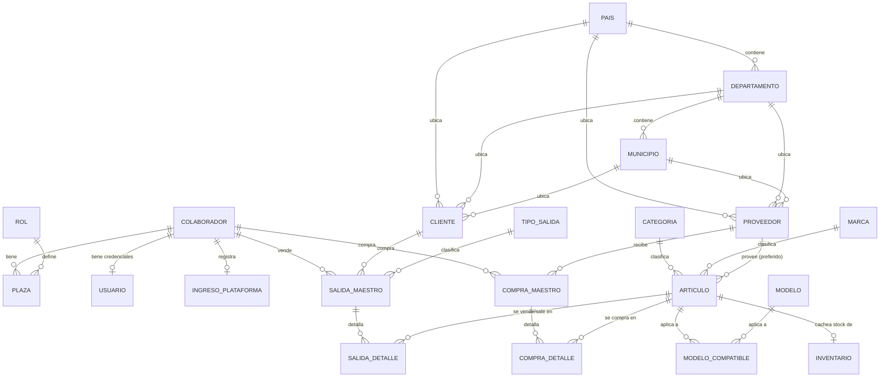

# Esquema de base de datos

Generado a partir de `backend/prisma/schema.prisma` (fuente de verdad — ver nota en
[CLAUDE.md](../CLAUDE.md) sobre por qué los nombres reales difieren de
[CONTEXTO_SIRX.md](../CONTEXTO_SIRX.md)). PostgreSQL, con tablas y columnas mapeadas
explícitamente a `snake_case` en minúsculas vía `@map`/`@@map` para calzar con un
esquema preexistente.

## Diagrama entidad-relación

## Convenciones

- **Nombres de tabla/columna**: mapeados explícitamente a `snake_case` (p. ej.
  `Colaborador.primerApel` → columna `primer_apel`, modelo `SalidaMaestro` →
  tabla `salida_maestro`) para coincidir con un esquema Postgres preexistente.
- **Sin `Movimiento` genérico**: en vez de una sola tabla de movimientos de
  inventario, hay dos flujos transaccionales simétricos independientes:
  compras (`CompraMaestro`/`CompraDetalle`, aumentan stock) y salidas
  (`SalidaMaestro`/`SalidaDetalle`, lo disminuyen), cada uno con separación
  encabezado/línea (maestro/detalle) **1—N**: una compra o una venta puede
  traer varias líneas de producto (ver migración
  `20260913000000_detalle_compra_salida_uno_a_muchos` — antes de HU-08/13
  esto era 1—1, una sola línea por transacción).
- **`SalidaMaestro.idTipoSalida` distingue el motivo sin ambigüedad**: en vez
  de agregar un campo de motivo por línea, HU-09/10/14 reutilizan el
  catálogo `TipoSalida` a nivel de encabezado — "Venta" (id 1) es la única
  que cuenta como ingreso (historial de HU-14); el resto ("Merma", "Uso
  interno", "Garantía", "Ajuste") son salidas no-venta (HU-09) y aparecen en
  el historial de movimientos por producto de HU-10 en vez del de ventas.
  Se prefirió esto sobre un campo nuevo porque ya modelaba exactamente esta
  distinción y evita duplicar el concepto — la ambigüedad de "devolución"
  documentada abajo es un problema aparte, no resuelto por este cambio.
- **`Inventario` es una tabla caché**: guarda el stock *actual* por SKU y se
  mantiene sincronizada transaccionalmente desde los flujos de compra/venta —
  no se calcula on-the-fly sumando movimientos.
- **Geografía compartida**: `Pais`/`Departamento`/`Municipio` son catálogos de
  referencia usados tanto por `Proveedor` como por `Cliente`.
- **Rol vía `Plaza`**: el rol de un `Colaborador` no es un campo fijo, sino una
  asignación con vigencia (`Plaza`, con `fechaInicio`/`fechaFin`) a un `Rol`.
  El JWT lleva el rol vigente resuelto (`req.usuario.role`), como cadena
  capitalizada (`"Administrador"` / `"Operador"`).

## Tablas

### `colaborador`
Persona física vinculada al sistema (empleado). Es la entidad raíz de la que
cuelgan credenciales, asignaciones de rol y las transacciones que realiza.

| Columna | Tipo | Notas |
|---|---|---|
| `id_colaborador` | `Int` (PK) | |
| `nombres` | `String` | |
| `primer_apel` | `String` | |
| `segundo_apel` | `String?` | |
| `correo` | `String?` | |
| `numero_celular` | `String?` | |
| `fec_transac` | `DateTime` | default `now()` |

Relaciones: `1—N Plaza`, `1—1 Usuario` (opcional), `1—1 IngresoPlataforma`
(opcional), `1—N SalidaMaestro` (como vendedor), `1—N CompraMaestro` (como
comprador).

### `rol`
Catálogo de roles del sistema (`Administrador`, `Operador`).

| Columna | Tipo | Notas |
|---|---|---|
| `id_rol` | `Int` (PK) | |
| `descripcion` | `String` | |

### `plaza`
Asignación de un colaborador a un rol, con vigencia temporal.

| Columna | Tipo | Notas |
|---|---|---|
| `id_plaza` | `Int` (PK) | |
| `fecha_inicio` | `DateTime` | |
| `fecha_fin` | `DateTime?` | `null` = vigente |
| `fec_transac` | `DateTime` | default `now()` |
| `id_rol` | `Int` (FK → `rol`) | |
| `id_colaborador` | `Int` (FK → `colaborador`) | |

### `usuario`
Credenciales de acceso (login, HU-01). Uno por colaborador.

| Columna | Tipo | Notas |
|---|---|---|
| `id_colaborador` | `Int` (PK, FK → `colaborador`) | |
| `usuario` | `String` (unique) | |
| `contraseña` | `String` | hash — columna con ñ en la BD |
| `vigente` | `Boolean` | default `true` |
| `fec_transac` | `DateTime` | default `now()` |
| `failed_attempts` | `Int` | default `0` — agregado sobre el modelo original |
| `locked_until` | `DateTime?` | agregado sobre el modelo original |

`failed_attempts`/`locked_until` implementan el bloqueo temporal de cuenta
(política: `MAX_LOGIN_ATTEMPTS` intentos, `LOCKOUT_MINUTES` de bloqueo).

### `ingreso_plataforma`
Registro de ingreso a la plataforma por colaborador.

| Columna | Tipo | Notas |
|---|---|---|
| `id_colaborador` | `Int` (PK, FK → `colaborador`) | |
| `fec_ingreso` | `DateTime` | |

### `pais` / `departamento` / `municipio`
Geografía de referencia, compartida por `proveedor` y `cliente`.

| Tabla | Columnas |
|---|---|
| `pais` | `id_pais` (PK), `nombre` |
| `departamento` | `id_departamento` (PK), `nombre` |
| `municipio` | `id_municipio` (PK), `nombre`, `id_departamento` (FK) |

### `proveedor`
| Columna | Tipo | Notas |
|---|---|---|
| `id_proveedor` | `Int` (PK) | |
| `nombre` | `String` | |
| `direccion` | `String?` | |
| `vigente` | `Boolean` | default `true` |
| `contacto` | `String?` | |
| `id_municipio` | `Int?` (FK) | |
| `id_departamento` | `Int?` (FK) | |
| `id_pais` | `Int` (FK) | |

### `categoria` / `marca`
Catálogos simples usados por `articulo`.

| Tabla | Columnas |
|---|---|
| `categoria` | `id_categoria` (PK), `descripcion` |
| `marca` | `id_marca` (PK), `nombre` |

### `articulo` (= "Repuesto" conceptual)
Catálogo de repuestos (HU-04). **Contiene los campos sensibles que se ocultan
al rol `Operador`**: `precio_costo` e `id_proveedor` (ver
`articuloService.js` / `formatearArticulo`, y la regla transversal en
[CLAUDE.md](../CLAUDE.md#security-requirements-apply-to-all-new-endpointsforms)).

| Columna | Tipo | Notas |
|---|---|---|
| `sku` | `String` (PK) | código único |
| `nombre` | `String` | |
| `inventario_minimo` | `Int` | default `0` — umbral de alerta de stock bajo |
| `precio_venta` | `Decimal` | |
| `precio_costo` | `Decimal` | **sensible** — solo Administrador |
| `ubicacion` | `String?` | |
| `estado` | `Boolean` | default `true` — activo/inactivo (no es el estado de stock) |
| `id_categoria` | `Int` (FK) | |
| `id_marca` | `Int?` (FK) | |
| `id_proveedor` | `Int?` (FK) | **sensible** — proveedor preferido, solo Administrador |

`inventario_minimo`, `ubicacion` e `id_proveedor` no estaban en el modelo
conceptual original — se agregaron para HU-04.

### `inventario`
Stock **cacheado** por SKU (no derivado on-read). Se mantiene en sincronía
transaccionalmente desde los flujos de compra/venta.

| Columna | Tipo | Notas |
|---|---|---|
| `sku` | `String` (PK, FK → `articulo`) | |
| `cantidad` | `Int` | default `0` — stock actual |
| `fec_transac` | `DateTime` | default `now()` |

Mapeo de estado de stock (UI, ver `CONTEXTO_SIRX.md` §8):
`cantidad > inventario_minimo` → *En stock* · `0 < cantidad <= inventario_minimo`
→ *Stock bajo* · `cantidad = 0` → *Agotado*.

### `modelo` / `modelo_compatible`
Modelos de vehículo compatibles con un repuesto (relación N—M).

| Tabla | Columnas |
|---|---|
| `modelo` | `id_modelo` (PK), `descripcion` |
| `modelo_compatible` | `sku` (FK → `articulo`), `id_modelo` (FK → `modelo`) — PK compuesta `(sku, id_modelo)` |

### `cliente`
| Columna | Tipo | Notas |
|---|---|---|
| `id_cliente` | `Int` (PK) | |
| `nombre` | `String` | |
| `direccion` | `String?` | |
| `contacto` | `String?` | |
| `id_departamento` | `Int?` (FK) | |
| `id_municipio` | `Int?` (FK) | |
| `id_pais` | `Int` (FK) | |

### `tipo_salida`
Catálogo del tipo de salida. Usado por HU-09/10/13/14 para separar ventas de
salidas no-venta (ver nota de convenciones arriba). Sembrado por
`seedDemo.js`.

| `id_tipo_salida` | `descripcion` |
|---|---|
| 1 | Venta |
| 2 | Merma |
| 3 | Uso interno |
| 4 | Garantía |
| 5 | Ajuste |

> Nota heredada de `CONTEXTO_SIRX.md` §9: la dirección de "devolución" sigue
> sin modelarse explícitamente (no distingue devolución a proveedor vs. de
> cliente) — no se agregó como tipo nuevo en esta ronda por no introducir un
> caso que no se validó con el negocio; "Ajuste"/"Merma" cubren el caso de
> corrección de inventario que sí pedían HU-09/10.

### Flujo de compras: `compra_maestro` / `compra_detalle` (HU-08)
Encabezado/líneas de una compra a proveedor (aumenta stock). Registrado por
`compraService.js` en una sola transacción: crea el maestro, una fila de
detalle por línea, e incrementa `inventario.cantidad` de cada SKU.
Administrador-only (`precio_compra`/`monto_total_compra` son datos de costo).

| Tabla | Columna | Tipo | Notas |
|---|---|---|---|
| `compra_maestro` | `id_compra` | `Int` (PK) | |
| | `fecha_compra` | `DateTime` | |
| | `fecha_pago` | `DateTime?` | |
| | `monto_total_compra` | `Decimal` | suma de `cantidad × precio_compra` de todas sus líneas |
| | `id_colaborador` | `Int` (FK) | quién registró la compra |
| | `id_proveedor` | `Int` (FK) | |
| `compra_detalle` | `id_detalle_compra` | `Int` (PK) | **1—N con el maestro** desde la migración `20260913000000_...` |
| | `id_compra` | `Int` (FK → `compra_maestro`) | |
| | `sku` | `String` (FK → `articulo`) | |
| | `precio_compra` | `Decimal` | |
| | `cantidad` | `Int` | |
| | `fec_compra` | `DateTime` | |

### Flujo de salidas: `salida_maestro` / `salida_detalle` (HU-09/13)
Encabezado/líneas de una venta (HU-13/14) o de una salida no-venta —
ajuste/merma (HU-09) — ambas disminuyen stock y comparten estas mismas
tablas; `id_tipo_salida` en el maestro es lo que las distingue (ver
convenciones arriba). Registrado en una sola transacción: crea el maestro,
una fila de detalle por línea, y decrementa `inventario.cantidad` de cada
SKU (validando antes que haya stock suficiente).

| Tabla | Columna | Tipo | Notas |
|---|---|---|---|
| `salida_maestro` | `id_venta` | `Int` (PK) | pese al nombre, es el id de cualquier salida (venta o no) |
| | `fecha_salida` | `DateTime` | |
| | `fecha_pago` | `DateTime?` | |
| | `monto_total_venta` | `Decimal?` | solo se calcula para ventas (HU-13); `null` en ajustes/mermas |
| | `id_colaborador` | `Int` (FK) | quién registró la salida |
| | `id_cliente` | `Int?` (FK) | solo en ventas; `null` en ajustes/mermas |
| | `id_tipo_salida` | `Int` (FK) | 1 = Venta; 2/3/4/5 = no-venta |
| `salida_detalle` | `id_detalle_salida` | `Int` (PK) | **1—N con el maestro** desde la migración `20260913000000_...` |
| | `id_salida` | `Int` (FK → `salida_maestro`) | |
| | `sku` | `String` (FK → `articulo`) | |
| | `precio_venta` | `Decimal?` | solo en líneas de venta; `null` en ajustes/mermas |
| | `cantidad` | `Int` | |
| | `fec_compra` | `DateTime` | *(nombre heredado del script original)* |

> **Migración `20260913000000_detalle_compra_salida_uno_a_muchos`**: antes de
> HU-08/13, `compra_detalle`/`salida_detalle` compartían PK con su maestro
> (`id_compra`/`id_salida`), es decir, eran 1—1 — una compra o venta solo
> podía tener una línea de producto. Se les dio PK propia
> (`id_detalle_compra`/`id_detalle_salida`) y `id_compra`/`id_salida` pasó a
> ser una FK normal, para soportar varias líneas por transacción. Migración
> aditiva: ambas tablas estaban vacías (ninguna historia las usaba todavía),
> y el backfill que agrega es seguro también si hubiera habido filas.

### Lecturas de solo consulta: HU-10, HU-12, HU-15
No agregan tablas — `movimientoService.js` (HU-10) combina `compra_detalle` +
`salida_detalle` (excluyendo `id_tipo_salida = Venta`) de un SKU;
`dashboardService.js` (HU-12/15) agrega sobre `articulo`/`inventario` (SKUs
activos, alertas de stock bajo) y sobre `salida_maestro` del día (ventas de
hoy, solo para Administrador — dato financiero, oculto a Operador).

## Estado local (dev)

- Motor: PostgreSQL 17 local (`localhost:5432`, base `sirx`).
- Migraciones aplicadas: `20260824000000_modelo_completo`,
  `20260826000000_hu04_catalogo_repuestos`,
  `20260913000000_detalle_compra_salida_uno_a_muchos`.
- Seed obligatorio (`npm run prisma:seed`): roles, geografía, usuarios
  `admin`/`operador`.
- Seed de demo (`npm run prisma:seed:demo`): 4 categorías, 4 marcas, 3
  modelos, 2 proveedores, 10 repuestos, 5 tipos de salida.
- Endpoints nuevos (HU-08/09/10/13/14/12/15): `/api/compras`,
  `/api/ajustes-inventario`, `/api/ventas`, `/api/movimientos/:sku`,
  `/api/dashboard/resumen` — ver `backend/src/routes/`.
